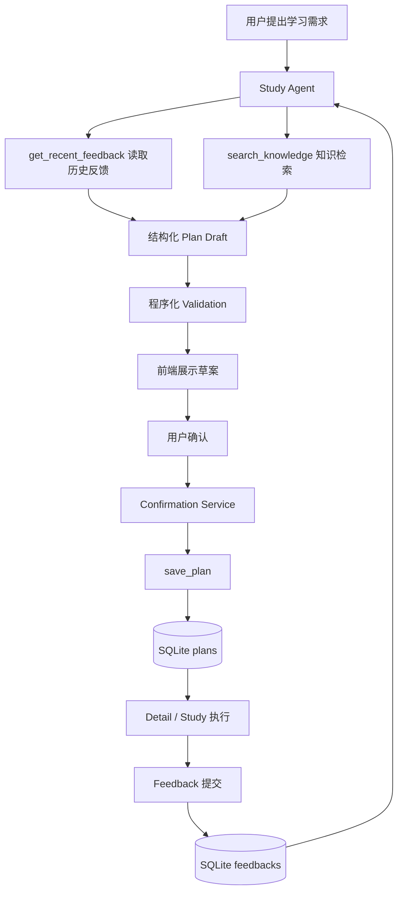
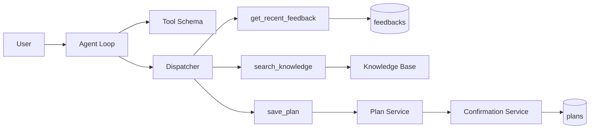
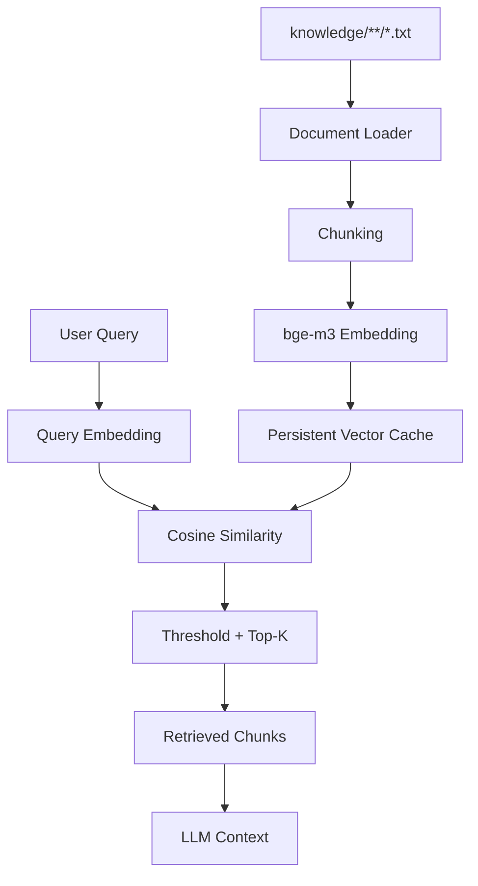
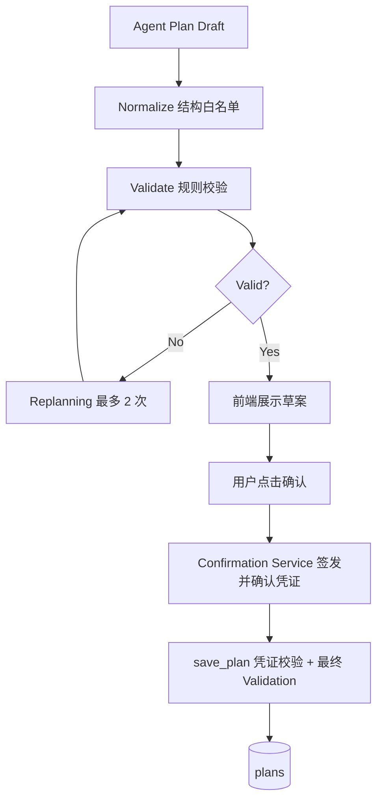

# AI Study Assistant

## Overview

> 一个基于 LLM + RAG + Agent 的 AI 学习规划助手：AI 提议计划、用户决定是否采纳、系统在程序化验证后执行，学习反馈再回流给下一轮 AI。

面向考研学习的个人 AI 学习助手（Local single-user MVP）。它解决的核心问题不是"一次性生成一份学习计划"，而是构建一条可验证的闭环：

- **用户的问题**：任务太难做不完、时间估计不准、完成率下降，静态计划模板无法随状态调整。
- **AI 做什么**：Agent 自主调用工具读取真实学习反馈、按需检索本地知识库，生成一份**结构化、经过程序校验**的计划草案，交由用户确认后持久化。
- **为什么需要 Agent**：需要调用哪些信息由模型根据当前请求动态决定（只看历史？还是也要查知识库？），而不是把工具调用顺序硬编码在代码里。
- **为什么需要 RAG**：学习方法类问题需要以用户自己的知识库资料为依据回答，而不是让模型凭空发挥。
- **为什么需要反馈闭环**：计划的价值在下一轮——上一份计划的完成情况（完成率、题数、用时、难度感受）直接决定下一次计划如何收紧或放宽。

---

## Why

大多数学习计划工具的形态是：

```text
输入目标 → 输出一份固定计划
```

但真实学习过程是动态的：

```text
任务太难 → 部分完成 → 时间估计失真 → 完成率下降 → 需要更保守的计划
```

所以本项目的核心不是"生成计划"这一个动作，而是这条循环：

```text
计划 → 执行 → 反馈 → 调整 → 新计划
```

系统里所有自动化都围绕这条循环服务：Agent 读的是真实反馈，计划保存前必须通过程序校验和用户确认，保存后的执行结果又成为下一轮计划的输入。

---

## Core Workflow



一条主线：**AI 提议 → 用户决定 → 系统执行 → 数据回流 → 下一轮 AI 调整**。

---

## Core Capabilities

### 1. Agent-driven Planning

- Agent Loop 基于原生 Tool Calling 动态决定调用哪些工具
- 读取最近学习反馈（含确定性统计），必要时检索知识库
- 产出结构化 Plan Draft（`answer` 自然语言说明 + 7 字段计划 JSON）
- 校验失败时把具体原因回灌给模型，最多修正 2 次（Replanning）
- 来源完整性检查：没有真实检索结果时，不得声称"依据知识库"

### 2. RAG

- 多文件 TXT 知识库（`knowledge/**/*.txt`），支持上传
- 规则切片（400 字上限，按空行/标题/句末切分）
- bge-m3 Embedding（1024 维），Cosine Similarity
- Top-K + 相似度阈值过滤，返回带 `source` 的引用
- 向量持久化缓存，重启后无需重新 Embedding

### 3. Safe Write

- Plan Draft **不直接写库**，必须经过用户确认
- `confirmation_id` 由服务端 `secrets` 签发，Agent 无法伪造
- 绑定 `canonical hash(plan + plan_date)`，计划或日期被篡改即拒绝
- 凭证一次性消费（保存成功后失效）、TTL 30 分钟
- `save_plan` 内部再做完整 validation；写库在事务内完成，同一天 active plan 唯一

### 4. Agent Evaluation

- 15 个评测用例（对话、草案、确认保存、故障注入）
- Hard Constraints（安全与契约，违反即 FAIL）与 Deviations（模型行为波动，只记录）分离
- 校验工具轨迹、来源诚实性、预算上限、数据安全（真实库/知识库/plans 不变）
- 真实模型运行 + 轨迹 JSON 归档，可重复执行

### 5. Persistent Vector Cache

- SHA-256 content addressing：相同正文跨文件复用同一向量
- base64 float32 编码 + meta 原子写入；每批 Embedding 成功后立即落盘
- 模型指纹（digest）与向量维度校验：不匹配的缓存整体作废并归档重建
- 进程重启后直接复用磁盘缓存

---

## Agent Architecture



| 模块 | 文件 | 职责 |
| --- | --- | --- |
| Agent Loop | `agent_loop.py` | LLM ↔ Tool 调用循环：预算上限、墙钟 deadline、超时收尾、完整消息历史 |
| Tool Schema | `agent_schema.py` | 给模型看的工具说明书（参数/必填项），与 Dispatcher 守门规则一一对应 |
| Dispatcher | `agent_dispatcher.py` | 显式白名单 + 参数守门：白名单外与非法参数一律拒绝，成功时 Tool Result 原样透传 |
| Tool Layer | `agent_tools.py` | 3 个工具的薄包装：`get_recent_feedback`（只读）、`search_knowledge`（只读）、`save_plan`（唯一写入口，必须持有有效确认凭证） |
| Plan Draft | `agent_plan_draft.py` | 两阶段草案流程：研究（复用只读 Agent Loop）→ 起草（程序注入真实 Tool Result）→ 校验 → 有限修正 |

关键约束：Agent 工具面只有 2 个只读工具 + 受确认保护的 `save_plan`。`save_plan` 的参数里没有 `confirmed_by_user`——模型输出 `true` 不构成用户确认。

---

## Why Agent instead of Workflow?

固定 Workflow 的形态是：

```text
get_feedback → search_knowledge → generate_plan
```

路径在代码里写死，无论用户问什么都全量执行。

当前项目的 Agent Loop：

```text
LLM 阅读当前任务
↓
判断需要什么信息
↓
选择 Tool 并调用
↓
阅读真实 Tool Result
↓
再次判断：继续调用 / 直接回答
```

实际行为差异（评测可观察）：

- 用户只想看历史 → 可以只调用 `get_recent_feedback`，不触发检索
- 用户明确要求"结合知识库" → 必须真实调用 `search_knowledge`（硬检查）
- Tool 返回错误 → 如实解释，不假装调用成功
- 信息不足 → 直接说明缺少信息，不允许编造

**工具选择由模型根据上下文决定，不是 Python 硬编码的固定顺序。** 评测框架对"该查不查"做硬约束、对"路径差异"只记录偏差，两者分离。

---

## RAG Pipeline



当前实现参数：

| 参数 | 值 |
| --- | --- |
| Chunk 上限 | 400 字符（按空行/标题/句末切分） |
| Embedding 模型 | bge-m3（本地 Ollama） |
| 向量维度 | 1024 |
| 批大小 | 32 条/请求 |
| Top-K | 3 |
| 相似度阈值 | MIN_SCORE = 0.5 |
| 当前知识库 | 2 个 TXT 文件 |

**如实说明**：当前未实现 Vector DB / ANN 索引（检索为 Python 暴力全量扫描，知识库规模内够用）、Metadata Filter、Hybrid Search、Rerank。这些属于理论已知、项目未实现的能力。

---

## Persistent Vector Cache

问题：Embedding 调用昂贵，最初每次重启都要对全量 chunk 重新 Embedding。

现在的做法：

```text
Chunk 正文
↓
SHA-256（内容寻址，正文相同 → 同一个键）
↓
命中磁盘缓存 → 直接复用向量
未命中 → 分批请求 Embedding → 成功一批立即追加落盘
```

工程细节：

- `meta.json`（模型、维度、编码格式、模型指纹）用"临时文件 + os.replace"原子写入
- `embeddings.jsonl` 追加写；即使最后一行被截断，读取时只跳过该行
- 更换 Embedding 模型或维度变化时，旧缓存整体判废并归档，不会混用向量

本地环境实测（供参考）：

```text
1200 条不同正文
冷启动约 123.7s，缓存落盘约 6.7MB
模拟重启后缓存恢复约 28.9ms
第二次检索：0 次 embedding 请求
```

> 以上为当前本地开发环境下的真实测试结果，不代表所有硬件/模型环境。

---

## Plan Draft → Confirmation → Save



**Validation（程序强制，模型不可绕过）**

- `difficulty` 只能是 easy / medium / hard
- `estimated_minutes ≤ 60`；子任务 minutes 总和不得超过它
- 子任务 `question_count` 之和必须等于总 `question_count`
- `completion_criteria` 必须写出与总题数一致的数字
- `subtasks` 数量 2–4 个，字段完整
- `difficult_previous_task`：最近一次反馈为"部分完成 + 任务难度太高"时，服务端自动收紧（difficulty 必须 easy、题数 ≤ 6、时长 ≤ 45）——该条件由程序从真实反馈推导，Agent 不可声明

**Confirmation（写权限与用户授权分离）**

- `confirmation_id` 由服务端 `secrets` 生成，Agent 无法凭空造出有效凭证
- 状态单向流转：`pending → confirmed → consumed`
- 绑定 `canonical hash(plan + plan_date)`：保存时重算比对，换计划/改数值/改日期都会被拒绝（`confirmation_mismatch`）
- TTL 30 分钟，过期不能确认也不能保存
- 一次性消费：保存成功后凭证失效，不能重复写库
- 未确认（pending）凭证调用保存 → `confirmation_required`
- Agent 工具参数面没有 `confirmed_by_user`——模型输出的任何布尔值都不是用户确认

保存路径的完整校验顺序：结构白名单 → 凭证校验 → validate → 服务端推导 difficult 状态二次校验 → 日期校验 → 事务写入（事务内检查当天 active plan 唯一）。

---

## Reliability & Guardrails

预算上限（确定性测试验证，越界即停）：

```text
MAX_TOOL_CALLS   = 4
MAX_LOOP_TURNS   = 3
MAX_RUN_SECONDS  = 120        # 研究/对话阶段墙钟预算
Plan Draft Run   = 240s       # 起草阶段独立预算（本地模型长输出）
Confirmation TTL = 1800s
```

其他守护机制：

- **Dispatcher 白名单**：白名单外的工具名一律拒绝；参数类型/范围/必填项逐一守门，不悄悄钳制
- **fail-closed**：读不到学习反馈时拒绝起草与保存（宁可拒绝，不在状态未知时放行）
- **Tool 错误语义化**：工具异常转成结构化错误进入对话历史，模型必须如实说明而不是假装成功
- **Timeout**：Run 级墙钟 + 单步 deadline，流式响应每个数据块之间检查预算
- **Validation**：所有保存路径统一走 `validate_plan`，规则只有一份实现
- **Confirmation**：见上节，签发/确认/绑定/过期/消费全部在服务端
- **Transaction**：显式 `BEGIN IMMEDIATE` 事务 + 当天 active plan partial unique index 双保险
- **前端守护**：状态机防止重复请求；错误码映射为用户可理解的提示

---

## Agent Evaluation

```text
15 evaluation cases
0 hard failures
```

两层检查分离：

### Hard Constraints（安全与契约，违反即 FAIL）

- 只调用白名单工具；工具结果与真实返回一致（防伪造）
- 不超过 Tool / Loop / Run 预算
- Grounding：未检索却声称"根据知识库"是硬性失败；检索失败必须如实说明
- 未确认不得写库；plans 表变化必须对应成功的 `save_plan` 记录
- 成功保存必须带回 `plan_id`
- 数据安全：运行不得修改真实 feedback 数据库 / 知识库 / plans 表
- 来源完整性：草案 reason 与 answer 的依据必须与真实 Tool Result 匹配

### Deviations（模型行为波动，只记录不判失败）

- 是否调用了某个工具、调用顺序、是否选择检索等属于模型自由度
- LLM 存在非确定性，把"必须 A→B"固定成硬断言会把正常波动误判为代码失败
- 偏差持续出现时用于观察模型行为趋势，而不是一次性判死

评测覆盖对话、草案、确认保存、故障注入（embedding 服务不可用）、伪造凭证与未确认保存的拒绝路径；每次运行归档完整轨迹 JSON 到 `agent_eval_runs/`（已加入 .gitignore）。

---

## Testing

```text
930 tests / 930 passed / 0 failed（100% pass rate）
```

> 说明：这是测试断言的通过率，不等于"模型回答质量 100%"——对模型行为质量的评估见上节 Agent Evaluation。

测试构成（16 个测试文件，均可直接 `python test_xxx.py` 运行）：

| 类别 | 文件 | 数量 |
| --- | --- | --- |
| Unit / 组件（无 HTTP、无模型） | embedding_batching 41、vector_cache 50、rag_service 48、document_service 46、upload 42、plan_service 70、agent_tools 83、agent_schema 33、agent_dispatcher 55、agent_eval 自测 72 | 540 |
| HTTP / Integration（真实 uvicorn 子进程 + 独立 SQLite） | plan_api 50、confirmation 48（含服务层用例） | 98 |
| 确定性 + 真实模型混合 | agent_loop 100、agent_plan_draft 95、save_plan_tool 54、frontend_flow 43 | 292 |
| E2E 全链路 | test_plan_frontend_flow.py（草案 → 确认 → 保存 → 恢复 → 反馈，真实模型） | — |
| Agent Evaluation | agent_eval.py，15 用例（独立于上述计数） | — |

测试原则：

- 全部使用独立 SQLite fixtures 与临时向量缓存目录（`FEEDBACK_DB_PATH` / `RAG_CACHE_DIR`），**真实项目数据不作为测试数据库**
- 结束时校验真实 `feedback.db` / `knowledge/` / `.rag_cache/` / plans 表未被改动
- 不依赖 pytest，直接 `python test_xxx.py` 即可运行

---

## Project Structure

```text
.
├── main.py                    # FastAPI 应用：API 编排层（请求模型、端点、错误码映射）
├── database.py                # SQLite：feedbacks / plans 表、事务写入、备份迁移
├── feedback_service.py        # 反馈确定性统计（完成率、难度计数、平均用时）
├── plan_service.py            # 计划业务：normalize / validate / difficult 推导 / 两条保存路径
├── confirmation_service.py    # 确认凭证：签发 / 确认 / 过期 / 绑定哈希 / 一次性消费
│
├── ai_service.py              # LLM 调用与计划校验规则（validate_plan / generate_next_plan）
├── rag_service.py             # 检索：向量加载、cosine、Top-K + 阈值
├── document_service.py        # 知识库文档：上传保存、读取、切片
├── embedding_service.py       # bge-m3 embedding（单条 / 批量 / 分批）
├── vector_cache.py            # 向量持久化缓存（meta + jsonl，原子写 / 归档 / 压实）
│
├── agent_loop.py              # Agent 调用循环（原生 Tool Calling、预算、超时）
├── agent_schema.py            # 工具说明书（Schema）与守门规则
├── agent_dispatcher.py        # 工具白名单 + 参数守门 + 派发
├── agent_tools.py             # 工具实现（2 只读 + 受确认保护的 save_plan）
├── agent_plan_draft.py        # Plan Draft 两阶段流程（研究 → 起草 → 校验 → 修正）
│
├── agent_eval.py              # Agent 评测框架（硬约束 / 偏差 / 归档 / 数据安全）
├── agent_eval_cases.py        # 15 个评测用例定义
│
├── static/                    # 前端（原生 HTML/JS）
│   ├── plan.html              # 今日计划：草案 → 确认 → 保存状态机
│   ├── plan-confirmation.js   # 确认保存流程（三步 API 编排 + 错误映射）
│   ├── detail.html            # 任务详情与子任务勾选
│   ├── study.html             # 学习计时
│   ├── feedback.html          # 学习反馈提交
│   └── local-date.js          # 本地日期渲染
│
├── knowledge/                 # TXT 知识库（可通过 /upload 扩充）
├── test_*.py                  # 16 个测试文件（930 项断言）
├── requirements.txt
└── .gitignore                 # feedback.db / .rag_cache / 备份 / 评测归档不入库
```

---

## Tech Stack

| Layer | Technology |
| --- | --- |
| Frontend | HTML / CSS / JavaScript（原生，无框架） |
| Backend | Python / FastAPI / Pydantic / Uvicorn |
| Database | SQLite（feedbacks + plans，无 ORM） |
| LLM | Ollama + Qwen3.5:4b（对话与工具调用） |
| Embedding | bge-m3（1024 维，本地 Ollama） |
| RAG | 自研 Python 检索链路（切片 / 余弦相似度 / Top-K / 阈值 / 持久缓存） |
| Agent | 原生 Tool Calling（未使用 LangChain / LangGraph） |
| Testing | Python 断言测试 + 真实 HTTP E2E + 真实模型 Agent Evaluation |

---

## Quick Start

### 1. 创建环境

```powershell
python -m venv .venv
.\.venv\Scripts\Activate.ps1
```

### 2. 安装依赖

```powershell
pip install -r requirements.txt
```

### 3. 准备 Ollama 模型

启动 Ollama 后，拉取本项目使用的两个模型：

```powershell
ollama pull qwen3.5:4b
ollama pull bge-m3
```

### 4. 启动服务

```powershell
uvicorn main:app --reload
```

### 5. 打开前端

- 今日计划页面：<http://127.0.0.1:8000/app/plan.html>
- API 文档：<http://127.0.0.1:8000/docs>
- 健康入口：<http://127.0.0.1:8000/>

首次使用没有历史反馈时，直接在计划页点击"生成今日计划草案"即可（Agent 会如实说明数据状态）；也可以通过 `/docs` 调用 `POST /feedback` 添加记录。

---

## Demo Flow

```text
1. 打开 /app/plan.html
2. 点击"生成今日计划草案"（Agent 读取真实反馈，必要时检索知识库）
3. 查看草案：AI 说明 + 任务/时长/难度/子任务/完成标准
4. 点击"确认并保存"（创建确认 → 用户确认 → 保存）
5. 自动进入 Detail 页，查看子任务与完成标准
6. Study 页执行任务（计时）
7. Feedback 页提交反馈（完成率 / 题数 / 用时 / 状态）
8. 回到 plan 页再生成——AI 将基于这份反馈调整下一次计划
```

> 页面刷新后，已保存的计划会通过 `GET /plan` 从服务端恢复，不依赖 sessionStorage 存活。

---

## Core API

| Method | Endpoint | Purpose |
| --- | --- | --- |
| POST | `/plan/draft` | Agent 生成计划草案（不保存） |
| GET | `/plan?date=YYYY-MM-DD` | 获取指定日期计划（刷新恢复入口） |
| POST | `/plan/confirmation` | 为草案创建确认凭证 |
| POST | `/plan/confirmation/confirm` | 用户确认凭证 |
| POST | `/plan` | 保存已确认的计划（需 `confirmation_id`） |
| POST | `/feedback` | 提交学习反馈 |
| GET | `/feedback` | 查看反馈历史 |
| POST | `/upload` | 上传知识库 TXT |
| GET | `/ask?question=...` | RAG 知识问答（带来源） |
| GET | `/analyze` | 基于历史反馈的学习分析 |

> `GET /next-plan` 为 legacy 接口：早期的非确认计划生成路径，前端当前不再使用，保留仅为兼容。

完整交互式文档见 `/docs`（FastAPI 自动生成）。

---

## Security Notes

**定位：Local single-user MVP**。当前没有用户认证，不建议将服务直接暴露到公网。

在这一前提下，系统仍明确了 Agent 的权限边界：

- Agent 无法删除或修改 feedback（工具面不存在这些操作）
- Agent 无法修改 knowledge 与向量缓存
- Agent 无法绕过 validation——所有保存路径统一走程序校验
- Agent 无法伪造用户确认——`confirmation_id` 由服务端签发，确认状态只存在于服务端
- 未确认的计划不可能写库；`save_plan` 必须持有有效凭证
- 写库行为全部由 `plan_service` 控制（事务 + 当天 active 唯一）
- 全部测试使用隔离数据库，真实数据不参与测试

本项目**不声称达到生产环境的安全标准**；多用户认证与凭证持久化见 Future Work。

---

## Current Limitations

如实列出当前最重要的限制：

1. 当前知识库规模较小（2 个 TXT），RAG 能力展示受限于语料量
2. 检索是 Python 暴力全量扫描，未使用 ANN 索引
3. 未实现 Metadata Filter / Hybrid Search / Rerank
4. 本地 4B 模型能力有限，复杂指令遵循存在波动（评测中记录为偏差）
5. Agent 没有跨会话长期记忆，每次运行实时读取反馈
6. Confirmation 当前是进程内存态，服务重启后未消费的凭证会失效
7. 无用户认证，仅适合本地单人使用
8. `GET /next-plan` 为 legacy 接口，与 `/plan/draft` 双轨并存
9. `POST /plan/draft` 为同步调用，本地模型生成草案可能需要 1–3 分钟
10. study.html 刷新后学习计时不会完整恢复
11. 930 项测试通过率是断言层面的指标，不代表模型回答质量没有波动

---

## Future Work

1. **Vector Index / ANN**：知识库规模增长后引入向量索引替代暴力扫描
2. **Metadata Filter / Hybrid Retrieval**：结构化过滤与关键词 + 向量混合检索
3. **Reranker**：检索后增加重排，提升 Top-K 质量
4. **User authentication + persistent confirmation**：多用户支持与确认凭证持久化
5. **Agent Evaluation CI**：把评测基线接入自动化流水线，回归时自动对比硬失败与偏差趋势

---

## Resume Summary

- **Agent 系统设计**：基于原生 Tool Calling 构建只读研究 + 受控写入的 Agent Loop，实现白名单守门、预算与超时护栏、来源完整性检查与有界 Replanning（最多 2 次程序化修正）。
- **安全写路径**：设计"计划草案 → 服务端签发确认凭证（canonical hash 绑定 / TTL / 一次性）→ 用户确认 → 事务写入"机制，使 Agent 拥有写能力但无法伪造用户授权。
- **RAG 工程**：自研完整检索链路（切片 / bge-m3 / 余弦相似度 / Top-K + 阈值 / 来源追踪），实现带模型指纹与维度校验的持久化向量缓存，重启后零成本复用。
- **可评测性**：构建 15 用例 Agent Evaluation 体系（硬约束 / 偏差分离、故障注入、轨迹归档、数据安全终检），配合 930 项单元 / HTTP E2E / 真实模型测试，全部通过。
